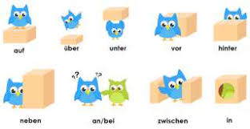

# Chapter 8

## Prepostitionen

---

### Temporal Prepostitionen

| Prepostition   | Zeit                         | Bispeil                               |
|----------------|------------------------------|---------------------------------------|
| ab      (Akk)  |  Uhrzeit  (jetzt -> drei Uhr)| ab drei Uhr                           |
| um      (Akk)  |  Uhrzeit                     | um drei Uhr (x drei Uhr)              |
| für     (Akk)  |  Zeitspanne                  | fur zwei Wochen                       |
| von/bis (Akk)  |  Uhrzeit                     | von 9 Uhr bis 10 Uhr                  |
| in      (Dat)  |  (jetzt -> Zeitpunkt Zukunft)| in der Nacht/im Juli/Summer           |
| an      (Dat)  |  Wochenende                  | am Deinstag / am Abend                |
| vor     (Dat)  |  before Zeitpunkt            | von dem Kurs                          |
| nach    (Dat)  |  After Zeitpunkt             | nach dem Kurs                         |
| seit    (Dat)  |  in past beginnen            | Seit einer woche, ich trinke Hönig    |
| ab      (Dat)  |  jetzt beginnen              | Am 1 Januar will ich Hönig trinken    |
| von/an  (Dat)  |  jetzt beginnen              | Von 1 Januar an will ich Hönig trinken|
| bei     (Dat)  |  gleichzeitig                | Bei dem Unterricht                    |
| während   (Gen)|  gleichzeitig                | wahrend des Unterricht (during)       |
| außerhalb (Gen)|   outside                    | Sie wohnt außerhalb der Stadt         |
| innerhalb (Gen)|   within                     | Das passiert innerhalb eine woche.    |

---

### Modal Prepostitionen

| Prepostition| Platz| Bispeil               |
|-------------|------|-----------------------|
| mit   (Dat) |  Wie | Ich fahre mit dem Taxi|
| ohne  (Akk) |      |                       |

---

### Lokal Prepostitionen

| Prepostition| Platz  | Bispeil                  |
|-------------|--------|--------------------------|
| aus         |  Woher | Ich komme aus dem Auto   |
| von         |  Woher | Ich komme von dem Frisuer|
| in          |  Wo    | Ich wohne in Berlin      |
| bei         |  Wo    | Ich bin bei dem Training |
| nach        |  Wohin | Ich gehe nach Berlin     |
| zu          |  Wohin | Ich gehe zu dem Arzt     |

---

#### With Verbs

Wo + Dativ (lying)| Wohin + Akkusativ (move)|
------------------|-------------------------|
 liegen           | legen                   |
 stehen           | stellen                 |
 stecken          | stecken                 |
 hangen           | hangen                  |

> **Preposition used** - auf, neben, an hinter, in uber, unter, vor, zwischen

Der Vogel + *verb* + *preposition* + Akkudative/Dativ + Box.

---

##### Akkusativ

| Prepostition     | Platz  | Bispeil                       |  Verb   |
|------------------|--------|-------------------------------|---------|
| auf/unter/nehmen |  Wohin | Ich legt es auf den Tisch     |  legen  |
| an               |  Wohin | Ich stelle es aus den Tisch   |  stellen|
| in               |  Wohin | Ich stecke es in die Geldbörse|  stecken|
| an               |  Wohin | Ich hängen es an die Wand     |  hängen |

---

##### Dativ

| Prepostition    | Platz| Bispeil                |  Verb   |
|-----------------|------|------------------------|---------|
| auf/unter/nehmen|  Wo  | Es liegen auf dem Tisch|  liegen |
| an              |  Wo  | Es stehen an der Ecke  |  stehen |
| in              |  Wo  | Es steckte im Schrank  |  stecken|
| an              |  Wo  | Es hängen an die Wand  |  hängen |

---
